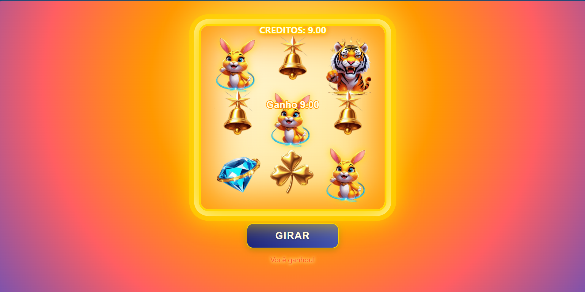
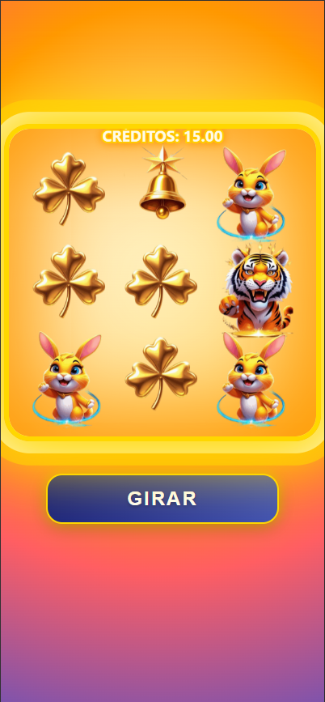
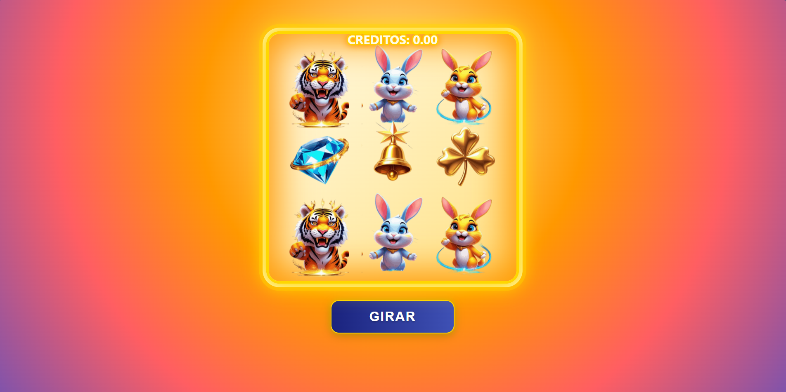

# Fortune Tiger Slot Game

Um jogo de caça-níquel inspirado no Fortune Tiger, desenvolvido com JavaScript puro e Canvas.

🎮 **[Jogue Agora a Demo](https://advansoftware.github.io/slot-game/)**

## ℹ️ Propósito do Projeto

Este projeto foi desenvolvido exclusivamente para fins educacionais, com o objetivo de:
- Estudo de animações usando Canvas
- Prática de JavaScript moderno (ES6+)
- Implementação de efeitos visuais e sonoros
- Gerenciamento de estados em JavaScript puro
- Otimização de performance em Canvas

**Nota**: Este é um projeto acadêmico e não deve ser usado para fins comerciais ou de apostas reais.



## 🎮 Funcionalidades

- Sistema de slots com 6 símbolos diferentes
- Animações suaves de giro
- Efeitos visuais para vitórias
- Sistema de pontuação
- Design responsivo
- Efeitos sonoros
- Partículas e efeitos especiais

## 🛠️ Tecnologias

- HTML5 Canvas
- JavaScript (ES6+)
- CSS3 com Animações
- Sprite Sheets para os símbolos

## 📁 Estrutura do Projeto

```
teste/
│
├── index.html          # Página principal
├── style.css          # Estilos do jogo
├── slot.js            # Lógica principal do slot
├── slotEffects.js     # Efeitos visuais e animações
├── icons_preto.png    # Sprite sheet dos símbolos
│
├── assets/            # Pasta de recursos
│   ├── spin.mp3      # Som de giro
│   ├── win.mp3       # Som de vitória
│   └── multiplier.mp3 # Som de multiplicador
│
└── screenshots/       # Pasta para imagens do README
    └── preview.png    # Preview do jogo
```

## 🎯 Como Usar

1. Clone o repositório:
```bash
git clone https://github.com/Advansoftware/slot-game.git
```

2. Você pode rodar o projeto de duas formas:

   ### Usando VS Code (Recomendado):
   1. Instale a extensão "Live Server"
   2. Clique com botão direito no arquivo `index.html`
   3. Selecione "Open with Live Server"

   ### Usando Python:
   ```bash
   python -m http.server 8000
   ```

3. Acesse em:
   - Live Server: `http://127.0.0.1:5500`
   - Python: `http://localhost:8000`

## 🔗 Links

- [Repositório no GitHub](https://github.com/Advansoftware/slot-game)
- [Reporte um Bug](https://github.com/Advansoftware/slot-game/issues)
- [Solicitações de Features](https://github.com/Advansoftware/slot-game/issues)

## 🎨 Personalização

### Símbolos
Os símbolos são definidos em `slot.js`:

```javascript
const symbols = [
    { name: 'tiger',   sx: 0, sy: 0 },
    { name: 'rabbitW', sx: 1, sy: 0 },
    // ...
];
```

### Valores dos Prêmios
Ajuste os valores em `slotEffects.js`:

```javascript
const symbolValues = {
    tiger: 2.00,
    rabbitW: 1.50,
    // ...
};
```

## 📱 Responsividade

O jogo se adapta automaticamente a diferentes tamanhos de tela:




## 🎵 Áudio

Para adicionar os sons, coloque os arquivos de áudio na pasta `assets/`:
- `spin.mp3`: Som de giro
- `win.mp3`: Som de vitória
- `multiplier.mp3`: Som do multiplicador

## 📸 Screenshots

Para adicionar screenshots ao README:

1. Crie uma pasta `screenshots` no projeto
2. Adicione suas imagens
3. Referencie usando markdown:
```markdown

```

## 🤝 Contribuindo

1. Faça um Fork
2. Crie uma Branch (`git checkout -b feature/AmazingFeature`)
3. Commit suas mudanças (`git commit -m 'Add some AmazingFeature'`)
4. Push para a Branch (`git push origin feature/AmazingFeature`)
5. Abra um Pull Request

## 📝 Licença

Distribuído sob a licença MIT. Veja `LICENSE` para mais informações.
